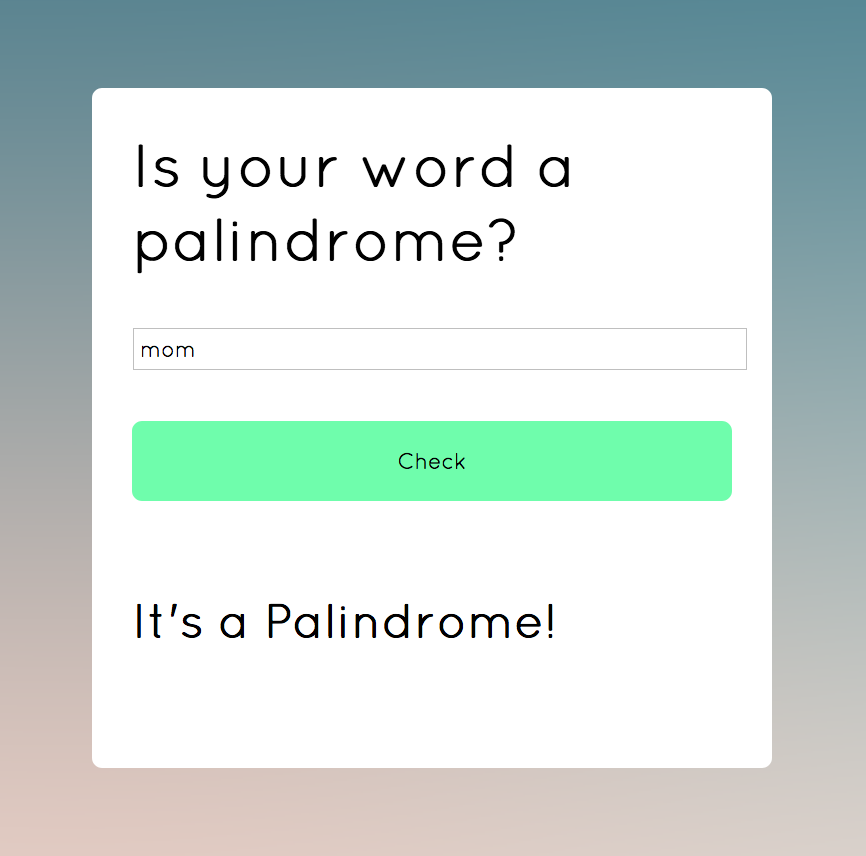

# Palindrome Server

User's can enter a word to see if it's a palindrome.

## How It's Made:

**Tech used:** HTML, CSS, JavaScript, Node.js

The function takes the entered string and determines: if the condition of our
variable str is equal to taking value from the variable text, splitting it into substrings, reversing it, then joining the letter back together, then "It's a palindrome" is returned. If
not it returns "It's not a palindrome"
